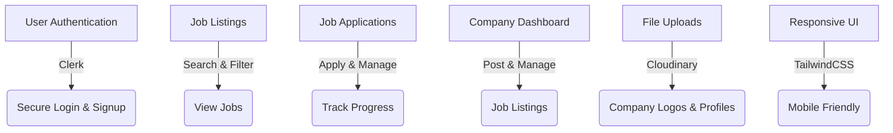
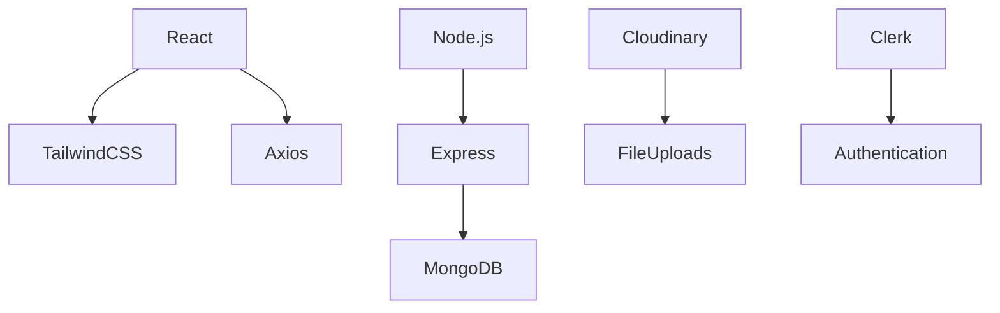
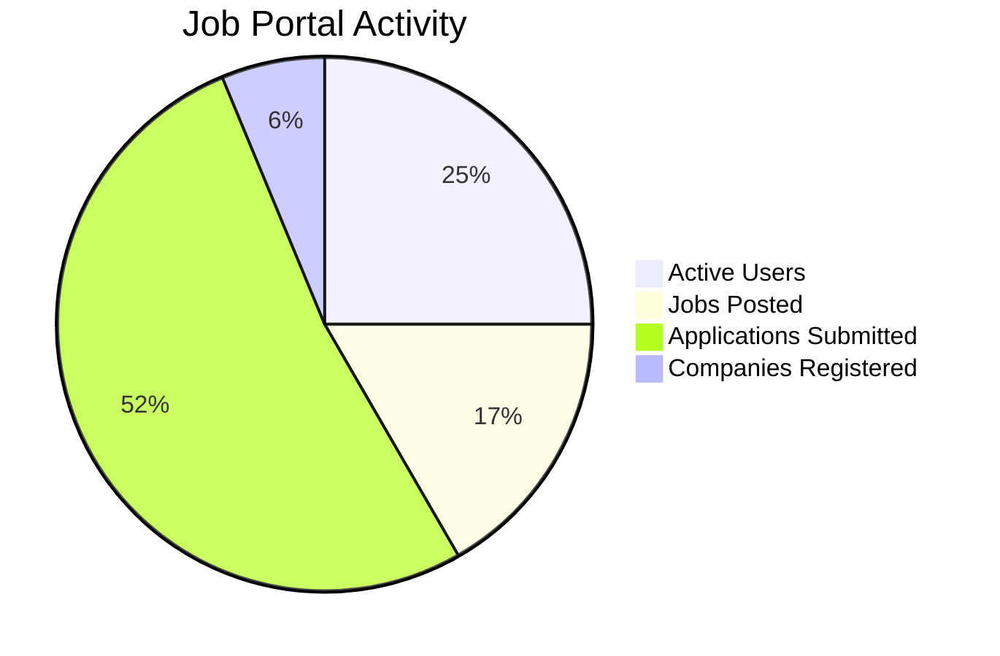

# Job Portal - Find Your Dream Job

🚀 **Overview**

Job Portal is a modern job-search application built with React and Node.js, allowing users to explore and apply for job opportunities while enabling companies to post and manage job listings.

---

🎨 **Features**



---

🎥 **Demo Preview**

(https://job-portal-client-wine-nine.vercel.app/)

---

📊 **Tech Stack**



---

📦 **Installation**

### Prerequisites
- Install Node.js and MongoDB

### Setup
```bash
git clone https://github.com/your-username/job-portal.git
cd job-portal
```

### Install dependencies
#### Frontend:
```bash
cd client
npm install
```
#### Backend:
```bash
cd server
npm install
```

### Environment Variables

Create `.env` files in both `client` and `server` directories:

#### Backend `.env`
```
MONGODB_URI=...
PORT=5000
JWT_SECRET=...
CLOUDINARY_CLOUD_NAME=...
CLOUDINARY_API_KEY=...
CLOUDINARY_API_SECRET=...
CLERK_API_KEY=...
NODE_ENV=development
```

#### Frontend `.env`
```
REACT_APP_CLERK_FRONTEND_API=...
REACT_APP_BACKEND_URL=http://localhost:5000
```

### Run the Application
#### Backend:
```bash
cd server
npm start
```
#### Frontend:
```bash
cd client
npm start
```

### Access the App
Open [http://localhost:3000](http://localhost:3000) in your browser.

---

📸 **UI Screenshots**

_(Insert relevant UI screenshots)_

---

📝 **Code Snippet (Job Posting API)**

```javascript
router.post("/post-job", async (req, res) => {
  try {
    const { title, description, company, location, salary } = req.body;
    const newJob = new Job({ title, description, company, location, salary });
    await newJob.save();
    res.status(201).json({ message: "Job posted successfully!" });
  } catch (error) {
    res.status(500).json({ error: "Server error" });
  }
});
```

---

📊 **Usage Statistics**



---

🤝 **Contributing**

1. Fork the repository
2. Create a new branch (`feature-awesome-thing`)
3. Commit your changes
4. Create a Pull Request

---

📩 **Contact & Support**

📧 Email: your-email@example.com  
💬 LinkedIn: [your-profile](#)

⭐ **Star this repo if you like it!** ⭐
